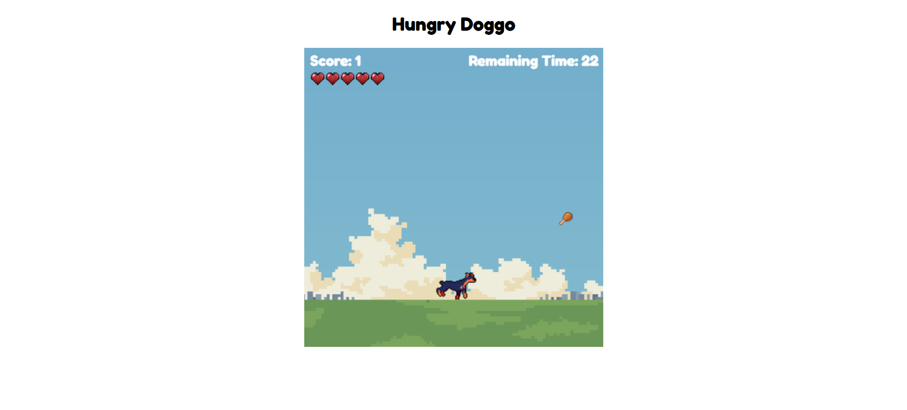

# HungryDoggo

## A casual web game built with pure HTML, CSS and JavaScript Canvas API

# Table of Contents
1. Features
2. Demo
3. Acknowledgments

# Features✨
### Core Gameplay
  - Simple keyboard controls
      -   Left/right arrow keys to move the dog
      -  Hold the keys for continuous movement
        
  - Collection mechanism
      - Catch chicken drumsticks for points (+1 per piece)
      - Avoid chocolate pieces (-1 point deduction and loss of life)
      
  - Progression system
      - Dynamic scoring system with bonus/penalty
      - Life system (5 lives initially)
      - Life loss upon contact with chocolate

### Built with JavaScript Canvas API 🔨
  - Canvas-Based Rendering
      - Object drawing via 2D Canvas context
      - Frame animations using requestAnimationFrame()
  - Custom Game Engine
      - Manual game loop with delta-time calculation
      - Custom collision detection (bounding boxes)
      - Coordinate-based object management system
  - Input Handling
      - Low-level keyboard event listeners

# Demo 🎮
[Live Demo Link/ GitHub Pages](https://anhvu1012.github.io/HungryDoggo-JavaScript/)

# Acknowledgments 🎓
### Art Asset
  - Background: artwork created by ["Misoshiru Studio"](https://misoshiru-studio.itch.io/forever-morning-parallax-background-free)
  - Dog: artwork created by ["Free Game Assets (GUI, Sprite, Tilesets)"](https://free-game-assets.itch.io/free-street-animal-pixel-art-asset-pack) on itch.io
  - Food (chicken drumsticks, chocolates): artwork created by ["OmelPixela"](https://omelpixela.itch.io/pixelart-food-items-part-01) on itch.io

### Sounds
  - Background music: a remix of "Background Sound N24" by Valo and and
"Game Music 2" by CollectionOfMemories, made by ["kevp888"](https://freesound.org/people/kevp888/sounds/723909/) on freesound.org
